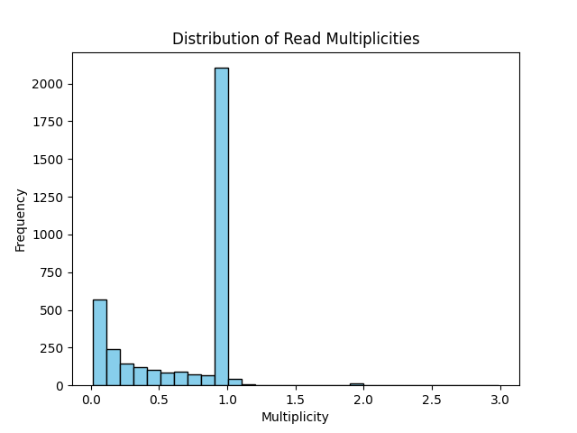

# multimers
plot multimers from nanopore whole plasmid sequencing data.

## install
```
git clone https://github.com/jacobhepkema/multimers.git
cd multimers
pip install -e .
```

Packages required: `biopython`, `matplotlib`.

## run
Assumes input is `FASTQ`. Output e.g. `read_lengths.png`.

```
usage: multimers [-h] [-o OUTPUT] [-p PLASMID_LEN] fastq_path

Process a FASTQ file from ONT whole plasmid sequencing and plot read lengths.

positional arguments:
  fastq_path            Path to the FASTQ file from ONT whole plasmid sequencing.

optional arguments:
  -h, --help            show this help message and exit
  -o OUTPUT, --output OUTPUT
                        Output file name for the plot (optional).
  -p PLASMID_LEN, --plasmid_len PLASMID_LEN
                        Plasmid length (optional).
```

## example output


